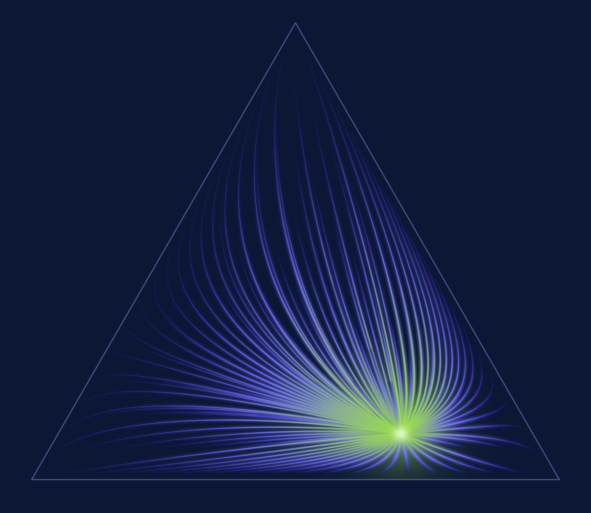

---
pagetitle: "My Name"
page-layout: full
code-tools: false
---

```{=html}
<div style="min-height: calc(100vh - 6rem);
            display: flex; flex-direction: column;
            justify-content: flex-start; align-items: center; padding-top: 0rem">
  <figure style="margin: 0; text-align: center;">
    
    <figcaption style="margin-top: 1rem; font-size: 0.95rem;
                       font-style: italic; color: #5b5f66;">
      Every belief flows to the truth — the natural-gradient descent of KL divergence on the simplex.
    </figcaption>
  </figure>
</div>
```