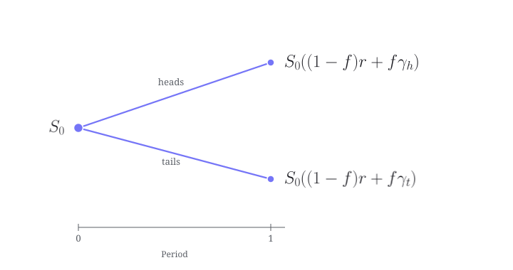

### Introduction
If intuition is any guide, it shouldn't be possible for a long-only portfolio to be profitable when each of its component assets is a lemon, unless, of course, one is clairvoyant and can predict those fleeting moments when random chance will favor each asset. Yet, as I'll demonstrate in this post, not only is it possible to do this without any clairvoyance whatsoever, but also an investor can (almost surely) guarantee an exponential amount of money in the long run from an appropriately constructed portfolio of such lemons. It turns out that information theory provides a lovely explanation for why this is possible. The culmination of this post is a simple, closed-form formula for the excess expected growth rate of a portfolio, which is expressed as the difference between two Kullback-Leibler divergences.

{#fig-van-gogh width="60%" fig-align="center" fig-alt="An impressionist painting by Vincent van Gogh depicting several bright yellow lemons piled on a simple ceramic plate against a textured, light-colored background."}


### Maxwell's demon and Shannon's demon
Named after the legendary physicist James Clerk Maxwell, Maxwell's demon is a thought experiment in physics in which a hypothetical microscopic demon controls a microscopic door separating two chambers of gas. The demon selectively sorts fast and slow molecules in the gas to pass through the door so that the fast molecules go to one chamber and the slow molecules go to the other, thereby creating a temperature difference without expending any of the system's energy. This procedure would lead to an increase in the free energy of the system, which could then be used to do useful work, seemingly violating the second law of thermodynamics. Put differently, the demon extracts useful work from heat, which is the random energy of the molecules, all at no apparent thermodynamic cost to the system. This is magic for a physicist, and like magic, it is impossible.

In a nod to Maxwell's demon, Shannon's demon, which is named after the founder of information theory, Claude Shannon, is a somewhat analogous thought experiment in investing in which the random up-and-down noise of asset prices (loosely analogous to heat in physics) can seemingly "magically" create wealth by rebalancing one's portfolio in just the right way so as to maximize the long-run growth rate. It is as if Shannon's demon is able to sort profitable outcomes from unprofitable ones. Unlike Maxwell's demon, however, Shannon's demon exists in the sense that it is a real, mathematically rigorous strategy that does not violate any inviolable laws of physics or finance. The connection to thermodynamics is purely one of loose analogy; the actual concepts are information-theoretic.


### The setup
In order to most clearly illustrate the concepts at play, I have necessarily chosen a very simple (and therefore unrealistic) example, in which there are only two assets to invest in: a risk-free asset with a negative interest rate and a risky asset modelled by a coin flip. Nonetheless, the results and machinery I develop here generalize to more realistic settings, though of course there are additional nuances and complications that arise in those cases, such as estimating return probabilities, accounting for transaction costs, and so on. In this post, however, I will ignore such complications in order to focus on the core ideas.

We will think of the risk-free asset as reminiscent of a Swiss bank account: the account is so safe and so desirable that it pays a _negative_ interest rate; hence, its associated gross return satisfies $r < 1.$ On the other hand, the risky asset, which I'll model as a coin flip, will be highly volatile in its outcome, where heads comes with a very handsome (gross) return of $\gamma_h$ with probability $p_h > 0$ and tails with a very steep loss $\gamma_t < r < \gamma_h$ (with probability $1 - p_h$). In addition, I'll set $\gamma_t = \alpha / \gamma_h$, for some $\alpha > 0$. Finally, I let $f$ denote the fraction of our money that we allocate to the risky asset; hence, $1 - f$ is the fraction that we allocate to the risk-free asset. After every period, we rebalance our portfolio to maintain these fractions. Our goal is to choose $f$ intelligently so that we make as much money as possible in the long run (or lose the least possible). I'll let $S_0$ denote the initial wealth. (Obviously, $r$ must be between $\gamma_t$ and $\gamma_h$ for this game to be interesting.)  

In what follows, let $w^T = (1 - f, f)$ denote the allocation vector and $X^T = (r, \gamma)$ the random gross returns vector, where $\gamma$ takes the value $\gamma_h$ with probability $p_h$ and $\gamma_t$ with probability $1 - p_h$. Note that $w^T = (1,0)$ corresponds to a portfolio consisting solely of the risk-free asset, and $w^T = (0,1)$ corresponds to a portfolio consisting solely of the risky asset. The portfolio gross return for a particular period is then given by $$Y(w) = w^T X = (1 - f)r + f\gamma,$$ so the wealth after $n$ periods is $$S_n(w) = S_0\prod_{i=1}^n Y_i(w),$$ where $Y_i(w)$ is the portfolio gross return in period $i$. This multiplicative branching of wealth, starting from the initial wealth $S_0$, is sketched in @fig-wealth-tree.

{#fig-wealth-tree fig-align="center" width="100%" fig-alt="A branching diagram. An orange node on the left, labelled S-zero, splits into two periwinkle nodes at period one: an upper branch labelled 'heads' to a node S-zero times (1 minus f) r plus f gamma-h, and a lower branch labelled 'tails' to a node S-zero times (1 minus f) r plus f gamma-t. The heads node sits slightly farther above S-zero than the tails node sits below it. A horizontal axis beneath is marked Period, at 0 and 1."}

For the specific example below, I'll set:

1. $r = 0.97$: a negative interest rate of 3% per period.
2. $\gamma_h = 2$: a 100% net gain on heads.
3. $p_h = 0.5$: it's a fair coin.
4. $\alpha = 0.8$: this implies $\gamma_t = 0.4$, i.e. a 60% net loss on tails.
5. $S_0 = 1$: initial wealth is normalized to 1.

```{python}
from coin_flip_with_riskless_asset_model import CoinFlipWithRisklessAssetModel
coin_flip_model = CoinFlipWithRisklessAssetModel(r=0.97, gamma_heads=2.0, p=0.5, alpha=0.80)
```


### The risky asset is a lemon
Obviously the risk-free asset is a lemon, as it bleeds 3% each period. While it is less obvious, the risky asset is also a lemon, which can be seen using Monte Carlo simulations. 

```{python}
import numpy as np
from finlib.ensemble_of_returns_paths import EnsembleOfReturnsPaths
from finlib.simulating_performance import crp_performance

seed = 12345
rng = np.random.default_rng(seed)
num_paths = 10_000
num_periods = 500

weights_for_risky_asset = np.array([0.0, 1.0]) # 0% in risk-free, 100% in risky
gross_returns_tensor = coin_flip_model.generate_random_gross_returns(rng, num_periods=num_periods, num_paths=num_paths)
perf_risky_matrix = crp_performance(weights_for_risky_asset, gross_returns_tensor)
ensemble_risky = EnsembleOfReturnsPaths.from_gross(perf_risky_matrix)

growth_rate_summary_df_risky = ensemble_risky.summarize_across_paths(ensemble_risky.running_growth_rate, threshold=0.0) 
wealth_summary_df_risky = ensemble_risky.summarize_across_paths(ensemble_risky.running_wealth_ratio, threshold=1.0) 
```

@fig-risky-wealth summarizes `{python} num_paths` simulated wealth paths over `{python} num_periods` periods (coin flips) for the risky asset. The shaded region indicates the middle 95% of these wealth paths.

```{python}
#| echo: false
#| label: fig-risky-wealth
#| fig-cap: "Simulated wealth paths for a portfolio held entirely in the risky asset. Top: wealth as a multiple of starting wealth, drawn on a logarithmic scale, with the empirical median, the empirical mean, and the middle 95% of paths. Bottom: the fraction of paths still at or above break-even."
##### WEALTH OVER TIME (spaghetti paths), risky asset #####

import pandas as pd
from plotting_functions import create_wealth_plot
wealth_paths_risky_asset = pd.DataFrame(
    ensemble_risky.running_wealth_ratio.T,
    index=wealth_summary_df_risky.index,
)

create_wealth_plot(
    wealth_paths_risky_asset,
    wealth_summary_df_risky,
)
```

Clearly the typical path through log-wealth space is downward sloping in the long run (top panel of @fig-risky-wealth). In addition, after only 100 coin flips, we see that fewer than 10% of the paths have made money, and after 250 flips, that fraction rapidly drops below 1%. After all 500 flips, it is essentially zero (bottom panel). 

Indeed, the wealth path tends to zero with probability one. To see this, we begin with the observation that since the sequence of random variables is i.i.d., the strong law of large numbers implies that the empirical growth rate, $W_n$, converges almost surely to the expected growth rate $W(w)$ (or simply "growth rate"):
$$
\begin{align}
W_n(w) &:= \frac{1}{n} \ln \left(\frac{S_n(w)}{S_0}\right) \\
&= \frac{1}{n} \sum_{i=1}^n \ln Y_i(w) \\
&\rightarrow \mathbb{E}\left[\ln Y(w)\right] \\
&=: W(w),
\end{align}
$$
which defines $W(w)$ (in nats / period). For the risky asset, we have $w^T = (0,1)$; hence,
$$
\begin{align}
W_n(w) &\rightarrow p_h \ln \gamma_h + (1 - p_h) \ln \gamma_t \\
&= \frac{1}{2} \big(\ln \gamma_h + \ln \gamma_t \big) \\
&= \frac{1}{2} \ln \alpha \\
&< 0,
\end{align}
$$
since $\alpha < 1$. Let $x$ be any number satisfying $\ln \sqrt{\alpha} < x < 0$. Then, by the definition of almost sure convergence, with probability one there exists some positive integer $N$ such that for all $n > N$, we have $W_n(w) < x < 0$. This implies that $S_n(w) = e^{n W_n(w)} < e^{n x} \rightarrow 0$ with probability one, which proves the claim that the risky asset is indeed a lemon.

Note that this result implies that, regardless of the starting allocation, any buy-and-hold strategy for these two assets will, with probability one, tend to a 100% loss in the long run. In order to avoid this fate, we will need to rebalance our portfolio periodically to some $f$, which may in principle be variable and depend on the realized results of the coin flips. In this post, however, I will restrict attention to constant rebalanced portfolios (CRPs), where $f$ is fixed and does not depend on past results. 


### The expected wealth is a mirage
The _expected value_ path for the risky asset, however, tells a very different story. After 500 periods, the expected value path (not shown in @fig-risky-wealth) for the risky asset sits around $4 \cdot 10^{39}$, which is many orders of magnitude better than both the sampled median and the sampled mean. This is because of the small number of rare paths with enough heads to make a killing. In fact, using the independence of the coin flips, we see that the expected wealth after $n$ periods diverges to infinity exponentially fast:
$$
\begin{align}
\mathbb{E}[S_n] &= \mathbb{E}\left[\prod_{i=1}^n Y_i\right] \\
&= \prod_{i=1}^n \mathbb{E}[Y_i] \\
&= \prod_{i=1}^n \mathbb{E}[\gamma_i] \\
&= \mathbb{E}[\gamma]^n \\
&= \big(p_h \gamma_h + (1 - p_h) \gamma_t \big)^n \\
&= 1.2^n \\
&\rightarrow \infty.
\end{align}
$$

Given that a wealth path tends to zero with probability one, the expected value path is a mirage, as the expected value is dominated by a small number of rare events, which are not representative of the typical outcome. 

{#fig-moran width="80%" fig-align="center" fig-alt="A luminous painting of the American West by Thomas Moran. A small party of riders on horseback fords a broad, glassy expanse of shallow water that mirrors the red sandstone cliffs and buttes rising behind them, all beneath a wide, cloudless blue sky."}

Let's now consider the probability that the path after $n$ periods at least hasn't lost any money, i.e. that $S_n \geq S_0 = 1$. For this simple model, we can actually compute this probability exactly. Letting $k$ denote the number of heads in $n$ flips, we have
$$
\begin{align}
\mathbb{P}(S_n \geq 1) &= \mathbb{P}(W_n \geq 0) \\
&= \mathbb{P}\left(\frac{1}{n} \sum_{i=1}^n \ln \gamma_i \geq 0\right) \\ 
&= \mathbb{P}\left(\frac{k}{n} \ln \gamma_h + \frac{n-k}{n} \ln \gamma_t \geq 0\right) \\ 
&= \mathbb{P}\left(k \geq \lceil c \rceil \right) \\ 
&= \sum_{k=\lceil c \rceil}^{n} \binom{n}{k} p_h^k (1 - p_h)^{n-k}, \\ 
\end{align}
$$
```{python}
#| echo: false
cut_off_as_fraction = -np.log(coin_flip_model.gamma_tails) / (np.log(coin_flip_model.gamma_heads) - np.log(coin_flip_model.gamma_tails))

import scipy.stats as ss
n = num_periods
m = np.ceil(cut_off_as_fraction*num_periods)
p_u = coin_flip_model.p
upper_tail_prob = ss.binom.sf(m - 1, n, p_u)
```

where $c/n = \frac{-\ln \gamma_t}{\ln \gamma_h - \ln \gamma_t} \approx{}$ `{python} f'{cut_off_as_fraction:.3f}'` solves $\frac{c}{n} \ln \gamma_h + \frac{n-c}{n} \ln \gamma_t = 0$. For $n = `{python} num_periods`$, this implies $c \approx {}$ `{python} f'{cut_off_as_fraction*num_periods:.3f}'`, yielding $\mathbb{P}(S_n \geq 1) \approx {}$ 0.001, one in a thousand. On the other hand, for $n = 500$, we have $\mathbb{E}[S_n] = 1.2^{500} \approx 4 \cdot 10^{39}$. So much for the expected value path being representative of the typical outcome.

To further underscore this point, we can compute an upper bound on this same tail probability by applying a Chernoff bound. The actual probability of heads $p_h = 0.5$, while the empirical probability of heads that would yield a non-negative growth rate is $\lceil c \rceil / n = 0.57 > 0.5$. Of all the empirical distributions of heads/tails that would achieve a non-negative growth rate, $(\lceil c \rceil / n, 1 - \lceil c \rceil / n)$ is the "closest" to the actual distribution $(0.5, 0.5)$ in the sense of minimizing Kullback-Leibler divergence. The Kullback-Leibler divergence, $D_{\text{KL}}$, is given by
$$
\begin{align}
D_{\text{KL}} &= \frac{\lceil c \rceil}{n} \ln \left(\frac{\lceil c \rceil / n}{p_h}\right) + \left(1 - \frac{\lceil c \rceil}{n}\right) \ln \left(\frac{1 - \lceil c \rceil / n}{1 - p_h}\right) \\
&= 0.57 \ln(0.57 / 0.5) + 0.43 \ln(0.43 / 0.5) \\
&\approx 0.0098
\end{align}
$$
The Chernoff bound then implies that $\mathbb{P}(S_n \geq 1) \leq e^{-n D_{\text{KL}}}$, which decays exponentially in $n$. @fig-no-loss-probability plots the exact tail probability against this bound.[^1] In what follows, I will drop the "KL" subscript from $D_{\text{KL}}$ and simply write $D$ for the Kullback-Leibler divergence.

[^1]: Note that the KL divergence appearing here is not directly related to the KL divergences that appear in the section [The connection to information theory](#the-connection-to-information-theory), though they are both measures of information.

```{python}
#| echo: false
#| label: fig-no-loss-probability
#| fig-cap: "The probability of not having lost money after $n$ coin flips, $\\mathbb{P}(S_n \\geq 1)$, together with its Chernoff upper bound $e^{-n D}$. This is the same quantity the bottom panel of @fig-risky-wealth estimates by simulation, resolved far into the tail."
##### PROBABILITY OF NOT LOSING MONEY (exact vs Chernoff bound) #####
from plotting_data import generate_no_loss_probability_data
from plotting_functions import create_no_loss_probability_plot

no_loss_probability_df = generate_no_loss_probability_data(coin_flip_model, num_periods)
create_no_loss_probability_plot(no_loss_probability_df)
```


### How to salvage a portfolio of lemons
Earlier I invoked the strong law of large numbers to show that the risky asset is a lemon: because its expected growth rate, $W(w),$ is negative whenever $\alpha < 1$, it will almost surely tend towards a 100% loss in the long run, and as I just showed, the probability of not losing money decays exponentially fast. Instead of letting our portfolio consist solely of the risky asset, however, we can instead choose $w$ to maximize $W(w) = \mathbb{E} \left[ \ln Y(w) \right].$ This maximum is unique because $W$ is a concave function of $w$. If we think of $W(w)$ as a function of $f$ (since $w^T = (1 - f, f)$), we can find the optimal fraction to allocate to the risky asset by taking the derivative with respect to $f$ and setting it equal to zero. Doing so, we find that the optimal fraction is given by 
$$
\begin{align}
f^* = r \frac{\Delta}{ab},
\end{align}
$$
where I've defined $\Delta = \mathbb{E}[\gamma] - r$, $a = \gamma_h - r$ and $b = r - \gamma_t$.

We see immediately that $f^*$ is positive (i.e. we invest at least some of our money in the risky asset) if and only if $\Delta > 0$. If $\Delta = 0$, then $f^* = 0$ and we invest all of our money in the risk-free asset. If $\Delta < 0$, then $f^* < 0$ and we would need to short the risky asset in order to maximize our expected growth rate. In our case, we are restricting ourselves to long-only portfolios (i.e. $0 \leq f \leq 1$), so we would simply invest all of our money in the risk-free asset. Since the growth rate diverges to negative infinity at $f = -r/a < 0$ and $f = r/b \geq 1$, we see that the optimal $f^*$ is always in the open interval $(-r/a, r/b)$.

Our formula for $f^*$ can also be written in a form that is perhaps more recognizable:
$$
\begin{align}
f^* &= r \frac{p_ha - (1-p_h)b}{ab} \\
&= r \left(\frac{p_h}{b} - \frac{1 - p_h}{a} \right),
\end{align}
$$
which, when $r = 1$, reduces to the most general form of the Kelly criterion for a single, two-state risky asset [@kelly1956]. In that context, $\Delta$ is often referred to as the "edge". If we not only let $r = 1$ but also $\gamma_t = 0$ (implying $b=1$), then we recover the Kelly criterion for $a$-to-$1$ odds: $f^* = \frac{p_h a - (1 - p_h)}{a}$, or "edge over odds".

For our specific example, we have $f^* \approx 0.38$, as shown in @fig-arithmetic-vs-geometric. In general, however, we will need to solve problems of this type numerically. At this growth-optimal allocation, the growth rate is $W(f^*) \approx 0.018$ bits/period (or about $0.012$ nats/period). This means that, on average, we can expect to double our money every $1 / 0.018 \approx 55$ periods -- not bad for a portfolio of lemons.

```{python}
####### FIND THE OPTIMAL CRP STRATEGY #####
opt_result_for_CRP = coin_flip_model.solve_growth_rate_maximization_problem()
f_star = opt_result_for_CRP.x
weights_for_optimal_CRP = np.array([1 - f_star, f_star])
```

Let's now simulate the performance of a portfolio using this optimal weighting to see whether my theoretical claims hold water. (For the reader more easily convinced by theory than by simulation, one of the canonical papers providing a theoretical justification for maximizing $W$ is [@breiman1961].) Using the same random number generator as before, I have simulated the performance of a portfolio using the optimal CRP strategy, as seen below. A striking feature of this simulation is that after only roughly 100 periods two thirds of wealth paths are at or above break-even.

```{python}
#| echo: false
#| label: fig-optimal-crp-wealth
#| fig-cap: "Simulated wealth paths for a portfolio using the optimal CRP strategy. Top: wealth as a multiple of starting wealth, drawn on a logarithmic scale, with the empirical median, the empirical mean, and the middle 95% of paths. Bottom: the fraction of paths still at or above break-even."
##### WEALTH OVER TIME (spaghetti paths), optimal CRP #####

perf_optimal_CRP_matrix = crp_performance(weights_for_optimal_CRP, gross_returns_tensor)
ensemble_optimal_CRP = EnsembleOfReturnsPaths.from_gross(perf_optimal_CRP_matrix)

growth_rate_summary_df_optimal_CRP = ensemble_optimal_CRP.summarize_across_paths(ensemble_optimal_CRP.running_growth_rate, threshold=0.0) # threshold is zero because we want to know the fraction of paths with positive growth rate at each period
wealth_summary_df_optimal_CRP = ensemble_optimal_CRP.summarize_across_paths(ensemble_optimal_CRP.running_wealth_ratio, threshold=1.0) # threshold is 1 because we want to know the fraction of paths with a positive net return.


wealth_paths_optimal_CRP = pd.DataFrame(
    ensemble_optimal_CRP.running_wealth_ratio.T,
    index=wealth_summary_df_optimal_CRP.index,
)

create_wealth_plot(
    wealth_paths_optimal_CRP,
    wealth_summary_df_optimal_CRP,
)
```

This may seem like magic or a sleight of hand, but it most certainly is not. Whereas Maxwell's demon mechanically sorts incoming molecules by operating a door, Shannon's demon mechanically rebalances the portfolio by buying and selling assets so that the portfolio weight vector $w^T(f) = (1 - f, f)$ is maintained using the optimal value $f^*$. This technique, which is sometimes referred to as "volatility harvesting", is somewhat reminiscent of a mean-reversion strategy, since the "demon" sells the risky asset if it has just gone up and buys it if it has just gone down, though to be clear, the random variables here are i.i.d. -- there is no serial correlation to exploit. By rebalancing to the optimal allocation $f^*$, the expected growth rate is positive, and the strong law of large numbers implies that the empirical growth rate will converge to this expected growth rate almost surely; hence, the wealth path will tend to infinity with probability one.

@fig-growth-convergence shows that convergence happening. Each panel shows the same law at work, though with two very different portfolios: a cloud of empirical growth rates converging onto their asymptotic values at a rate proportional to $1/\sqrt{n}$.  For the risky asset it is $\frac{1}{2} \log_2 \alpha \approx -0.161$ bits per period, which almost surely guarantees long-run ruin. For the optimal CRP it is $W(f^*) \approx 0.018$ bits per period, and the guarantee reverses: wealth will almost surely tend to infinity. Note, however, that even after `{python} num_periods` periods, a not insignificant proportion of wealth paths for the optimal portfolio are below water. 

```{python}
#| echo: false
#| label: fig-growth-convergence
#| fig-cap: "The empirical growth rate $W_n$ converging on the theoretical growth rate $W(w)$, over the same simulated paths as above. Top: the risky asset alone, whose asymptote lies *below* break-even. Bottom: the growth-optimal CRP, whose asymptote lies *above* it. Each panel shows the individual paths, the middle 95% of them, and the asymptote (dashed, periwinkle); the neutral dashed line is break-even. The panels carry different vertical scales. The opening periods swing well outside the frame. Both panels are driven by the same simulated coin flips, so hovering over any path lights up the same sequence in both. This is one run of luck with two allocations."
##### EMPIRICAL GROWTH RATE OVER TIME (spaghetti paths), risky asset vs optimal CRP #####
from plotting_functions import create_growth_rate_convergence_plot

growth_rate_paths_risky_asset = pd.DataFrame(
    ensemble_risky.running_growth_rate.T,
    index=growth_rate_summary_df_risky.index,
)
growth_rate_paths_optimal_CRP = pd.DataFrame(
    ensemble_optimal_CRP.running_growth_rate.T,
    index=growth_rate_summary_df_optimal_CRP.index,
)

create_growth_rate_convergence_plot(
    growth_rate_paths_risky_asset,
    growth_rate_summary_df_risky,
    weights_for_risky_asset,
    growth_rate_paths_optimal_CRP,
    growth_rate_summary_df_optimal_CRP,
    weights_for_optimal_CRP,
    coin_flip_model,
)
```

```{=html}
<!--
  Linked hover for @fig-growth-convergence. Both panels are simulated from one
  tensor of coin flips, so a path in the top panel and the path with the same
  meta.path in the bottom are the same run of luck under a different allocation.
  Hovering either lights up both, which is the whole point: Plotly has no
  cross-subplot linked highlighting, so it takes a plotly_hover binding.

  Everything style-related comes from the figure (layout.meta for the lit
  colour, each path's own SVG for the faint one), so nothing here has to know
  the brand palette. The figure is found by layout.meta.figure rather than by
  element id, which Quarto generates.

  It paints the SVG directly rather than going through Plotly.restyle, which
  costs ~77ms on a figure of this many traces -- five frames, and visibly
  laggy on a mousemove. Writing the stroke costs nothing measurable. Plotly
  applies the faint look as an inline style in three parts (stroke,
  stroke-opacity, stroke-width), and stroke-opacity is the one doing the
  fading, so all three are captured up front and all three are put back.
-->
<script>
(function () {
  function bind(gd) {
    var lit = gd.layout.meta.hero, litWidth = gd.layout.meta.litWidth + "px";
    var byPath = new Map();   // path key -> one record per panel
    gd.data.forEach(function (t, i) {
      if (!t.meta || t.meta.path === undefined) return;
      // Plotly classes each trace's <g> as "trace" + uid; the figure pins uid.
      var g = gd.querySelector("g.trace.trace" + t.uid);
      var el = g && g.querySelector("path.js-line");
      if (!el) return;
      if (!byPath.has(t.meta.path)) byPath.set(t.meta.path, []);
      byPath.get(t.meta.path).push({
        g: g, el: el, i: i,
        sub: (t.xaxis || "x") + (t.yaxis || "y"),   // "xy" / "x2y2"
        stroke: el.style.stroke,
        opacity: el.style.strokeOpacity, width: el.style.strokeWidth
      });
    });
    if (byPath.size === 0) return false;

    var on = null, echoed = null;
    function paint(key, up) {
      byPath.get(key).forEach(function (r) {
        r.el.style.stroke = up ? lit : r.stroke;
        r.el.style.strokeOpacity = up ? 1 : r.opacity;
        r.el.style.strokeWidth = up ? litWidth : r.width;
        // Raise it above the cloud: in the converged region a few hundred
        // paths overlap, and at 0.06 each they stack to near-opaque, so a lit
        // line left in place would be painted over. Faint paths are
        // indistinguishable from one another, so leaving it raised is harmless.
        if (up) r.g.parentNode.appendChild(r.g);
      });
    }
    function douse() {
      if (on !== null) { paint(on, false); on = null; }
      echoed = null;
    }
    gd.on("plotly_hover", function (ev) {
      var pt = ev.points[0];
      var t = gd.data[pt.curveNumber];
      if (!t.meta || t.meta.path === undefined) return;
      if (t.meta.path !== on) { douse(); on = t.meta.path; paint(on, true); }

      // Read both panels at once. Plotly only labels the subplot the cursor is
      // actually over, but the interesting comparison is between the panels, so
      // echo the hover onto both at the same period.
      var recs = byPath.get(on);
      if (recs.length < 2) return;
      // Fx.hover re-emits plotly_hover, so without a guard this would recurse.
      // Keying the guard on what we last echoed (rather than a flag) is safe
      // whether Fx.hover dispatches synchronously or not: the re-entrant call
      // always carries the same path and period, so it matches and stops here.
      var sig = on + ":" + pt.pointNumber;
      if (sig === echoed) return;
      echoed = sig;
      Plotly.Fx.hover(gd,
        recs.map(function (r) { return { curveNumber: r.i, pointNumber: pt.pointNumber }; }),
        recs.map(function (r) { return r.sub; }));
    });
    gd.on("plotly_unhover", douse);
    return true;
  }

  // Poll: the div is written by Quarto's own Plotly bundle, so there is no
  // event of ours to wait on. Gives up rather than spinning forever.
  var tries = 0;
  var timer = setInterval(function () {
    var found = false;
    document.querySelectorAll(".plotly-graph-div").forEach(function (gd) {
      var m = gd.layout && gd.layout.meta;
      if (!m || m.figure !== "growth-convergence" || gd._linkedHover) return;
      gd._linkedHover = true;
      found = bind(gd);
    });
    if (found || ++tries > 40) clearInterval(timer);
  }, 250);
})();
</script>
```

Crucially, the growth-rate is a concave function of $w$. While it is true that the expected _return_ is a linear function of $f$, the expected _growth rate_ $W = W(w)$ -- which is the quantity that actually drives long-run performance [@breiman1961] -- is a concave function of $w$. This concavity is readily seen in the bottom panel of @fig-arithmetic-vs-geometric. The values of $f$ that fall between the two black "X" marks in @fig-arithmetic-vs-geometric are those that yield a positive expected growth rate, and hence almost surely $S_n \rightarrow \infty$. Such gambles have been defined elsewhere as "favorable" [@breiman1961]. 

The concavity of $W$ shows the value of diversification in a new light. In traditional mean-variance portfolio theory, diversification is typically justified as a means of reducing risk.[^2] However, in the context of maximizing long-run wealth (our goal), diversification emerges from an attempt to maximize the growth rate. Nowhere have I ever mentioned "risk". 

[^2]: Of course, there are other justifications as well. I do not claim that the only justification offered for diversification is risk reduction, but it is certainly the most common one. 


```{python}
#| echo: false
#| label: fig-arithmetic-vs-geometric
#| fig-cap: "Arithmetic and geometric returns as a function of the fraction $f$ allocated to the risky asset. Top: arithmetic and geometric gross returns. Bottom: the logarithm (base 2) of the curves above (the growth rate), where the shaded band is the compounding drag $\\log_2 \\mathbb{E}[Y] - \\mathbb{E}[\\log_2 Y]$. The growth-optimal allocation $f^*$ is marked."
from plotting_data import generate_arithmetic_vs_geometric_data
from plotting_functions import create_arithmetic_vs_geometric_plot
arith_geo_df = generate_arithmetic_vs_geometric_data(coin_flip_model)
create_arithmetic_vs_geometric_plot(arith_geo_df, opt_result_for_CRP)
```


### The connection to information theory {#the-connection-to-information-theory}
Since $W(f^*)$ is the best achievable growth rate, let's take a closer look at it. We have
$$
\begin{align}
W(f^*) &= \mathbb{E}\left[\ln Y \right] \\
&= p_h \ln \big((1 - f^*)r + f^*\gamma_h\big) + (1 - p_h) \ln \big((1 - f^*)r + f^*\gamma_t \big) \\
&= p_h \ln \big(r + af^* \big) + (1 - p_h) \ln \big(r - bf^* \big) \\
&= \ln r + p_h \ln \left(1 + \frac{\Delta}{b} \right) + (1 - p_h) \ln \left(1 - \frac{\Delta}{a} \right) \\
&= \ln r + p_h \ln \left(\frac{p_h(a+b)}{b} \right) + (1 - p_h) \ln \left(\frac{(1-p_h)(a+b)}{a} \right) \\
&= \ln r + p_h \ln \left(\frac{p_h}{q_h} \right) + p_t \ln \left(\frac{p_t}{q_t} \right) \\
&= \ln r + D\left(p \| q\right), \\
\end{align}
$$
where $q_h = b / (a + b)$ and $q_t = a / (a + b)$ are alternative probabilities of heads and tails, respectively, where I've let $p_t = 1 - p_h$ for notational convenience, and where $D(p \| q)$ is the Kullback-Leibler (KL) divergence from the model $q = (q_h, q_t)$ to the actual distribution $p = (p_h, p_t)$. Interestingly, $q$ turns out to be the risk-neutral probability distribution for this setup, i.e. the expected return of both assets under $q$ is exactly the risk-free return $r$:
$$
\begin{align}
\mathbb{E}_{q}[Y(f)] &= q_h Y_h(f) + q_t Y_t(f) = r,
\end{align}
$$
which is independent of $f$, a property we will come back to in a moment. 


Since $D\left(p \| q\right) \ge 0$ with equality if and only if $p = q$, we see that we have an edge whenever the actual distribution of returns differs from the risk-neutral distribution. The portfolio's excess growth rate over the risk-free asset is equal to the excess number of bits per period needed to encode the actual distribution of returns $p$ using a code optimized for the risk-neutral distribution $q$. Importantly, this tells us that, with probability one, in the long run, one will always be able to beat the risk-free asset by an exponential amount whenever the actual distribution of returns differs from the risk-neutral distribution. 

We have discovered a formula for $W(f^*)$. Let's now try to find a formula for $W(f)$ more generally, i.e. where we no longer require $f = f^*$. To do this, notice that there is another probability distribution hiding in plain sight: since $\mathbb{E}_{q}[Y(f)] = r$ for all $f$, if we simply divide by $r$, we see that we have derived a new probability distribution $m_f = \left(m_h(f), m_t(f) \right)$ that depends on $f$:
$$
\begin{align}
m_h(f) &= \frac{q_h Y_h(f)}{r}, \quad m_t(f) = \frac{q_t Y_t(f)}{r}.
\end{align}
$$
Observe that $m_f$ is just a tilted version of the risk-neutral distribution $q$ by the discounted portfolio gross returns $Y(f)$, and that it is indeed a probability distribution since $m_h(f) + m_t(f) = 1$, and both terms are non-negative. 

We can now derive the key result of this post (in nats):
$$
\begin{align}
W(f) &= p_h \ln Y_h(f) + p_t \ln Y_t(f) \\
&= p_h \ln \left(\frac{q_h Y_h(f)}{r} \frac{r}{q_h} \right) + p_t \ln \left(\frac{q_t Y_t(f)}{r} \frac{r}{q_t} \right) \\
&= \ln r + p_h \ln \left(\frac{m_h(f)}{q_h} \right) + p_t \ln \left(\frac{m_t(f)}{q_t} \right), \\
\end{align}
$$
or
$$
\boxed{\,W(f) = \ln r + D\!\left(p \,\|\, q\right) - D\!\left(p \,\|\, m_f\right).  \,}
$$

We've worked in nats throughout; dividing the result by $\ln 2$ re-expresses this in bits. From this result, we see that the excess growth rate, $W(f) - \ln r$, is a measure of information. It is the difference between the KL divergence from the risk-neutral distribution $q$ to the actual distribution $p$ and the KL divergence from the tilted risk-neutral distribution $m_f$ to the actual distribution $p$. The first term is independent of $f$ and determines the maximum possible excess growth rate, while the second term is minimized by choosing $f$ so that $m_f = p$.


### Conclusion
Unlike Maxwell's demon, Shannon's demon is, in the sense made clear in this post, real. More scientifically, the key takeaways from this post are:

1. Long-run performance is determined by the expected growth rate, $W(f) = \mathbb{E}[\ln Y(f)]$, _not_ the expected return, $\mathbb{E}[Y(f)]$.
2. Unlike the expected return, which is a _linear_ function of $f$, the expected growth rate is a _concave_ function of $f$.
3. Since typically we have $0 < f^* < 1$, diversification is required to maximize the long-run expected performance of a portfolio. Diversification isn't simply a means of reducing risk.
4. The excess growth rate is a measure of information, as it is the difference between two Kullback-Leibler divergences. 
5. The excess growth rate is only ever positive when the actual distribution $p$ of returns differs from the risk-neutral distribution $q$.
6. The optimal growth rate is achieved when the tilted risk-neutral distribution $m_f$ matches the actual distribution $p$.


### References
::: {#refs}
:::
