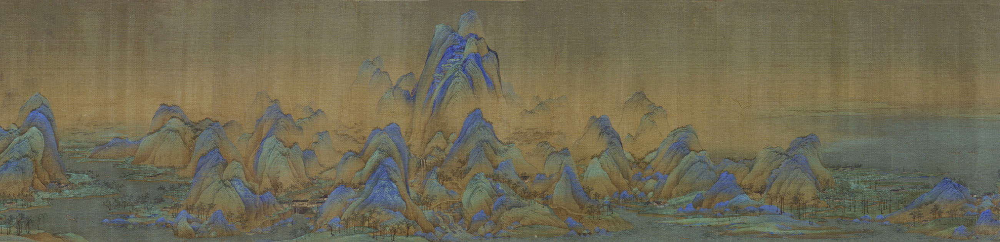

<!--
  Scroll viewer widget for "A Thousand Li of Rivers and Mountains".
  Included from index.qmd via .

  Self-contained: <style>, the <figure>, and the <script> below have no
  external dependencies. Class names are all prefixed with `scroll-viewer__`
  so nothing collides with the site's own CSS. The JS is IIFE-wrapped so
  nothing leaks to the global scope.

  To tune:
    - loop duration:  data-loop-seconds on the <figure> (currently 240)
    - fade delay:     CONTROLS_FADE_MS in the script (currently 2500)
    - display height: `height: clamp(...)` on .scroll-viewer__slit
-->

```{=html}
<style>
  .scroll-viewer {
    margin: 2rem 0;
    padding: 0;
  }

  /* The "slit" — the fixed-size window through which the scroll moves.
     Width fills its column; height adapts within sane bounds. */
  .scroll-viewer__slit {
    position: relative;
    width: 100%;
    height: clamp(280px, 42vw, 500px);
    overflow: hidden;
    background: #1a1a1a;
    border-radius: 2px;
    user-select: none;
    -webkit-user-select: none;
  }

  /* Poster (the still section image) — shown before the reader presses play. */
  .scroll-viewer__poster {
    position: absolute;
    inset: 0;
    width: 100%;
    height: 100%;
    object-fit: cover;
    object-position: center;
    display: block;
    transition: opacity 250ms ease;
  }

  /* The strip: two copies of the scroll image, back-to-back, translated left. */
  .scroll-viewer__strip {
    position: absolute;
    top: 0;
    left: 0;
    height: 100%;
    display: flex;
    will-change: transform;
    transform: translate3d(0, 0, 0);
  }
  .scroll-viewer__strip {
    cursor: pointer;
  }
  .scroll-viewer__strip img {
    height: 100%;
    width: auto;
    display: block;
    flex-shrink: 0;
    pointer-events: none;
  }

  /* Control row along the bottom of the slit: play button + progress bar.
     z-index keeps the controls above the animated strip. Opacity is toggled
     by JS to auto-fade the controls during playback. */
  .scroll-viewer__controls {
    position: absolute;
    left: 12px;
    right: 12px;
    bottom: 12px;
    z-index: 2;
    display: flex;
    align-items: center;
    gap: 12px;
    opacity: 1;
    transition: opacity 400ms ease;
  }
  .scroll-viewer.is-controls-faded .scroll-viewer__controls {
    opacity: 0;
  }

  /* Play / pause button. */
  .scroll-viewer__toggle {
    position: relative;
    flex: 0 0 auto;
    width: 44px;
    height: 44px;
    padding: 0;
    border: none;
    border-radius: 50%;
    background: rgba(20, 20, 20, 0.72);
    color: white;
    font-size: 16px;
    line-height: 1;
    cursor: pointer;
    display: flex;
    align-items: center;
    justify-content: center;
    backdrop-filter: blur(4px);
    -webkit-backdrop-filter: blur(4px);
    transition: background 150ms ease, transform 100ms ease;
  }
  .scroll-viewer__toggle:hover { background: rgba(20, 20, 20, 0.9); }
  .scroll-viewer__toggle:active { transform: scale(0.94); }
  .scroll-viewer__toggle:focus-visible { outline: 2px solid #4a90e2; outline-offset: 2px; }
  .scroll-viewer__toggle[disabled] { cursor: wait; opacity: 0.6; }

  /* Loading indicator — a subtle spinning ring inside the button. */
  .scroll-viewer__toggle.is-loading::before {
    content: "";
    position: absolute;
    inset: 8px;
    border: 2px solid rgba(255,255,255,0.3);
    border-top-color: white;
    border-radius: 50%;
    animation: sv-spin 0.9s linear infinite;
  }
  @keyframes sv-spin { to { transform: rotate(360deg); } }
  .scroll-viewer__toggle.is-loading .scroll-viewer__icon { opacity: 0; }

  /* Progress / seek bar — hidden until first play. */
  .scroll-viewer__progress {
    flex: 1 1 auto;
    height: 6px;
    background: rgba(255, 255, 255, 0.22);
    border-radius: 3px;
    cursor: pointer;
    position: relative;
    display: none;
    transition: height 120ms ease, background 120ms ease;
    touch-action: none;
    backdrop-filter: blur(4px);
    -webkit-backdrop-filter: blur(4px);
  }
  .scroll-viewer.is-started .scroll-viewer__progress { display: block; }
  .scroll-viewer__progress:hover,
  .scroll-viewer__progress.is-dragging {
    height: 10px;
    background: rgba(255, 255, 255, 0.28);
  }
  .scroll-viewer__progress:focus-visible {
    outline: 2px solid #4a90e2;
    outline-offset: 3px;
  }
  .scroll-viewer__progress-fill {
    height: 100%;
    background: rgba(255, 255, 255, 0.92);
    border-radius: 3px;
    width: 0%;
    pointer-events: none;
    will-change: width;
  }

  .scroll-viewer figcaption {
    margin-top: 0.75rem;
    font-size: 0.9rem;
    line-height: 1.45;
    color: rgba(0, 0, 0, 0.66);
  }
  @media (prefers-color-scheme: dark) {
    .scroll-viewer figcaption { color: rgba(255, 255, 255, 0.66); }
  }
  .scroll-viewer figcaption a {
    color: inherit;
    text-decoration: underline;
    text-decoration-thickness: 1px;
    text-underline-offset: 2px;
  }
</style>

<figure class="scroll-viewer"
        data-poster="a-thousand-li-of-rivers-and-mountains(section).jpg"
        data-scroll="a-thousand-li-of-rivers-and-mountains(scroll).jpg"
        data-full="a-thousand-li-of-rivers-and-mountains(complete).jpg"
        data-loop-seconds="240">
  <div class="scroll-viewer__slit">
    
    <div class="scroll-viewer__controls">
      <button class="scroll-viewer__toggle"
              type="button"
              aria-label="Play the scroll animation">
        <span class="scroll-viewer__icon" aria-hidden="true">&#9654;</span>
      </button>
      <div class="scroll-viewer__progress"
           role="slider"
           tabindex="0"
           aria-label="Scroll position"
           aria-valuemin="0"
           aria-valuemax="100"
           aria-valuenow="0">
        <div class="scroll-viewer__progress-fill"></div>
      </div>
    </div>
  </div>
  <figcaption>
    Wang Ximeng, <em>A Thousand Li of Rivers and Mountains</em>, 1113. The Palace Museum, Beijing. At nearly forty feet long, this priceless work of art is a hand scroll painted on silk using azurite (blue) and malachite (green) that was designed to be unfurled slowly, revealing the vast Chinese landscape and scenes from the daily lives of ordinary people living during the Northern Song Dynasty, a period of immense wealth and sophistication. <a href="a-thousand-li-of-rivers-and-mountains(complete).jpg" target="_blank" rel="noopener">View full resolution&nbsp;↗</a>
  </figcaption>
</figure>

<script>
(function () {
  const ICON_PLAY  = "▶";
  const ICON_PAUSE = "⏸";

  const REDUCED_MOTION =
    window.matchMedia && window.matchMedia("(prefers-reduced-motion: reduce)").matches;

  function init(root) {
    const slit    = root.querySelector(".scroll-viewer__slit");
    const poster  = root.querySelector(".scroll-viewer__poster");
    const btn     = root.querySelector(".scroll-viewer__toggle");
    const iconEl  = btn.querySelector(".scroll-viewer__icon");
    const bar     = root.querySelector(".scroll-viewer__progress");
    const fill    = root.querySelector(".scroll-viewer__progress-fill");

    const scrollSrc    = root.dataset.scroll;
    const loopSeconds  = Math.max(10, parseFloat(root.dataset.loopSeconds) || 120);

    let strip = null;
    let imgDisplayedWidth = 0;
    let offset = 0;
    let rafId = null;
    let lastTs = 0;
    let state = "idle";        // "idle" | "loading" | "playing" | "paused"

    // ---- Auto-fade of controls during playback.
    const CONTROLS_FADE_MS = 2500;
    let fadeTimer = null;

    function scheduleFade() {
      clearTimeout(fadeTimer);
      fadeTimer = setTimeout(function () {
        if (state === "playing" && !dragging) {
          root.classList.add("is-controls-faded");
        }
      }, CONTROLS_FADE_MS);
    }

    function revealControls() {
      root.classList.remove("is-controls-faded");
      clearTimeout(fadeTimer);
      if (state === "playing") scheduleFade();
    }

    // ---- Build the animated strip (two copies of the scroll image, back-to-back).
    function buildStrip(imgSrc, naturalW, naturalH) {
      strip = document.createElement("div");
      strip.className = "scroll-viewer__strip";
      for (let i = 0; i < 2; i++) {
        const im = document.createElement("img");
        im.src = imgSrc;
        im.alt = "";
        im.setAttribute("aria-hidden", "true");
        im.draggable = false;
        strip.appendChild(im);
      }
      strip.dataset.aspect = String(naturalW / naturalH);
      strip.addEventListener("click", function () {
        if (state === "playing") pause();
        else if (state === "paused") play();
      });
      slit.appendChild(strip);
      recomputeWidth();
    }

    function recomputeWidth() {
      if (!strip) return;
      const aspect = parseFloat(strip.dataset.aspect);
      const h = slit.clientHeight;
      imgDisplayedWidth = h * aspect;
      offset = ((offset % imgDisplayedWidth) + imgDisplayedWidth) % imgDisplayedWidth;
      applyTransform();
    }

    function applyTransform() {
      if (!strip) return;
      strip.style.transform = "translate3d(" + (-offset).toFixed(2) + "px, 0, 0)";
      if (imgDisplayedWidth > 0) {
        const frac = offset / imgDisplayedWidth;
        fill.style.width = (frac * 100).toFixed(2) + "%";
        bar.setAttribute("aria-valuenow", Math.round(frac * 100));
      }
    }

    function tick(ts) {
      if (state !== "playing") return;
      if (!lastTs) lastTs = ts;
      const dt = (ts - lastTs) / 1000;
      lastTs = ts;

      const speed = imgDisplayedWidth / loopSeconds;
      offset += speed * dt;
      if (offset >= imgDisplayedWidth) offset -= imgDisplayedWidth;

      applyTransform();
      rafId = requestAnimationFrame(tick);
    }

    function setIcon(sym) { iconEl.textContent = sym; }

    function loadThenPlay() {
      if (state === "loading" || state === "playing") return;
      state = "loading";
      btn.disabled = true;
      btn.classList.add("is-loading");
      btn.setAttribute("aria-label", "Loading");

      const im = new Image();
      im.onload = function () {
        buildStrip(scrollSrc, im.naturalWidth, im.naturalHeight);
        poster.style.opacity = "0";
        setTimeout(() => { poster.style.display = "none"; }, 260);

        btn.classList.remove("is-loading");
        btn.disabled = false;
        root.classList.add("is-started");
        play();
      };
      im.onerror = function () {
        btn.classList.remove("is-loading");
        btn.disabled = false;
        state = "idle";
        btn.setAttribute("aria-label", "Play the scroll animation");
        console.warn("scroll-viewer: failed to load", scrollSrc);
      };
      im.src = scrollSrc;
    }

    function play() {
      if (!strip) { loadThenPlay(); return; }
      state = "playing";
      setIcon(ICON_PAUSE);
      btn.setAttribute("aria-label", "Pause the scroll animation");
      lastTs = 0;
      rafId = requestAnimationFrame(tick);
      scheduleFade();
    }

    function pause() {
      if (state !== "playing") return;
      state = "paused";
      if (rafId) cancelAnimationFrame(rafId);
      rafId = null;
      setIcon(ICON_PLAY);
      btn.setAttribute("aria-label", "Resume the scroll animation");
      root.classList.remove("is-controls-faded");
      clearTimeout(fadeTimer);
    }

    // ---- Wire up controls.
    btn.addEventListener("click", function () {
      if (state === "playing") pause();
      else if (state === "paused") play();
      else if (state === "idle") loadThenPlay();
    });

    // ---- Scrubbing: click or drag the progress bar to seek within the loop.
    let dragging = false;
    let wasPlayingBeforeDrag = false;

    function seekFromEvent(ev) {
      if (!strip || imgDisplayedWidth <= 0) return;
      const rect = bar.getBoundingClientRect();
      let frac = (ev.clientX - rect.left) / rect.width;
      frac = Math.max(0, Math.min(1, frac));
      offset = frac * imgDisplayedWidth;
      applyTransform();
    }

    bar.addEventListener("pointerdown", function (ev) {
      if (!strip) return;
      dragging = true;
      wasPlayingBeforeDrag = (state === "playing");
      if (wasPlayingBeforeDrag) pause();
      bar.classList.add("is-dragging");
      bar.setPointerCapture(ev.pointerId);
      seekFromEvent(ev);
      ev.preventDefault();
    });

    bar.addEventListener("pointermove", function (ev) {
      if (!dragging) return;
      seekFromEvent(ev);
    });

    function endDrag(ev) {
      if (!dragging) return;
      dragging = false;
      bar.classList.remove("is-dragging");
      try { bar.releasePointerCapture(ev.pointerId); } catch (e) { /* ignore */ }
      if (wasPlayingBeforeDrag) play();
    }
    bar.addEventListener("pointerup", endDrag);
    bar.addEventListener("pointercancel", endDrag);

    // Keyboard: arrow keys nudge, Home/End jump to ends.
    bar.addEventListener("keydown", function (ev) {
      if (!strip || imgDisplayedWidth <= 0) return;
      const nudge = imgDisplayedWidth * 0.02;
      const big   = imgDisplayedWidth * 0.10;
      let handled = true;
      switch (ev.key) {
        case "ArrowRight": offset += (ev.shiftKey ? big : nudge); break;
        case "ArrowLeft":  offset -= (ev.shiftKey ? big : nudge); break;
        case "Home":       offset = 0; break;
        case "End":        offset = imgDisplayedWidth - 1; break;
        default: handled = false;
      }
      if (handled) {
        offset = ((offset % imgDisplayedWidth) + imgDisplayedWidth) % imgDisplayedWidth;
        applyTransform();
        ev.preventDefault();
      }
    });

    // Any pointer activity anywhere inside the slit reveals the controls.
    slit.addEventListener("pointermove", revealControls);
    slit.addEventListener("pointerdown", revealControls);
    slit.addEventListener("touchstart", revealControls, { passive: true });

    // Keyboard focus on a control also reveals — never hide a focused element.
    btn.addEventListener("focus", revealControls);
    bar.addEventListener("focus", revealControls);

    // Recompute geometry on resize (debounced via rAF).
    let resizePending = false;
    window.addEventListener("resize", function () {
      if (resizePending) return;
      resizePending = true;
      requestAnimationFrame(function () {
        resizePending = false;
        recomputeWidth();
      });
    });

    // Pause when the tab is hidden — no need to burn cycles for something no one sees.
    document.addEventListener("visibilitychange", function () {
      if (document.hidden && state === "playing") {
        pause();
        root.dataset.wasPlaying = "1";
      } else if (!document.hidden && root.dataset.wasPlaying === "1") {
        root.dataset.wasPlaying = "";
        play();
      }
    });

    void REDUCED_MOTION;
  }

  // Defensive: if the script runs before the <figure> is in the DOM (which
  // can happen when Quarto reorders raw-HTML blocks), wait for DOMContentLoaded.
  function start() {
    const nodes = document.querySelectorAll(".scroll-viewer");
    if (!nodes.length) {
      console.warn("scroll-viewer: no .scroll-viewer element found in DOM at init time");
      return;
    }
    nodes.forEach(init);
  }
  if (document.readyState === "loading") {
    document.addEventListener("DOMContentLoaded", start);
  } else {
    start();
  }
})();
</script>
```
